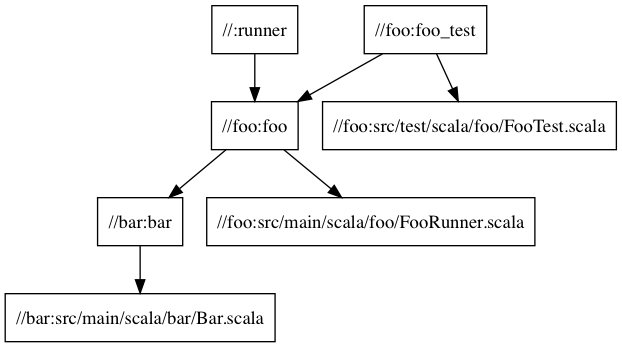

# Minimal Bazel Scala Example

A simple example of a Scala multi-module project configured to build
using [Bazel](https://www.bazel.build).

Including:

* A main class `foo.FooRunner`
* A library `foo` which depends on library `bar`
* An external dependency (ScalaTest)
* A test `foo.FooTest`

Feedback / pull requests welcome.

## Running All Tests

    bazel test //...

## Running App

    bazel run runner

Or, once built using Bazel, call the generated run-script:

    bazel-bin/runner

## Start a REPL

    bazel build repl
    bazel-bin/repl

## Review the dependency graph

    bazel query  --nohost_deps --noimplicit_deps 'deps(//...)' --output graph > graph.dot
    dot graph.dot -Tpng -o graph.png

# Reference

https://github.com/bazelbuild/rules_scala